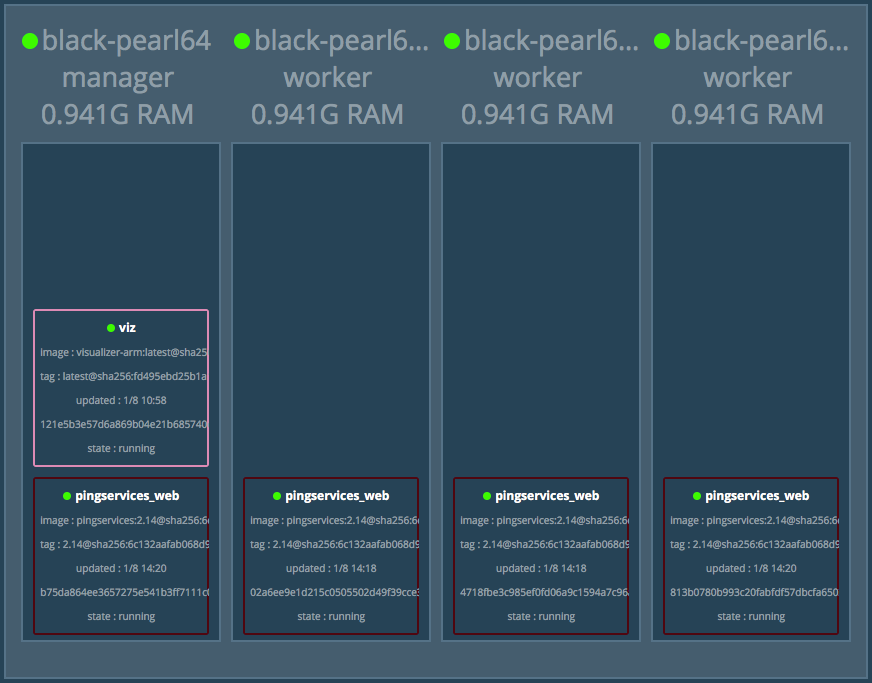

# Project Docker container on raspberry PI 3 cluster

We should update this documentation to be more of a step guide...

## HypriotOS 64-bits armv8

We will use hypriotOS on all four raspberry PI 3 since after all it is 64 bits. This distribution is prepared with *docker 1.13.1* by Dieter Reuter excellent work. You find the image here on github. Follow the instructions by Dieter. I flash this to a SD card using etcher on OSX, that the only differences.

	image: https://github.com/DieterReuter/image-builder-rpi64/releases/tag/v20170303-185520
	repo: https://github.com/DieterReuter/image-builder-rpi64

## device-init
When you boot up the server on raspberry pi 3 it's going to have a hostname of **black-pearl**, the user is **pirate** with password **hypriot**. To be able to build a cluster you need to set different hostname for each node. In the **/boot/** directory there is a utility for this by the team of hypriot. **/boot/device-init**. You can set the hostname and even wifi settings thru this utility.

	# To show hostname
	$ device-init hostname show
	# To set hostname
	$ device-init hostname set <hostname>
	# If you just use "device-init -c" it will use yaml file @ "/boot/device-init.yml"

Repeat the above steps for each RPi-3.

For our project we will set the following names for each Raspberry Pi-3.

* Master: black-pearl64
* Worker1: black-pearl64-w1
* Worker2: black-pearl64-w2
* Worker3: black-pearl64-w3

As you can se in the picture above, hypriotOS 64bit comes with docker 1.13.1 preinstalled.

# Build our go program for target OS and architecture

To be able to execute our go program in the container based on resin/rpi-raspbian we have to compile for the right target environment. In this case we will set GOOS=linux and GOARCH=arm64.

	# We need to compile for 64-bits armv8
	$ GOOS=linux GOARCH=arm64 go build -v

	$ file pingservices

	If you execute "file pingservices" (OSX) you will se that it's compile for the right target environment.

	# pingservices: ELF 64-bit LSB executable, ARM aarch64, version 1 (SYSV), statically linked, stripped

# Build our image 

**Dockerfile.builder**

Now we will start to build up our image layer by layer, we start with **resin/rpi-raspbian** as our base layer. You find this on http://hub.docker.com. After this you will start adding our go programs all prerequisite, directories and files.

    # -------------------------------------------------
    # FROM resin/rpi-raspbian
    # MAINTAINER kjell.almgren@tetracon.se
    # -------------------------------------------------
	#
    FROM resin/rpi-raspbian

    MAINTAINER kjell.almgren@tetracon.se

    # make some update to the OS in the container, comment out at this point
    #RUN apk update && \
    #apk upgrade && \
    #apk add bash && \
    #rm -rf /var/cache/apk/*

    #COPY docker-compose.yml docker-compose.yaml
    #switch to our app directory (/pingservices)
    RUN mkdir -p /pingservices
    WORKDIR /pingservices

    #create our sub directories
    RUN mkdir -p dist/css/
    RUN mkdir -p dist/fonts
    RUN mkdir -p dist/js
    RUN mkdir -p images
    RUN mkdir -p templates
    RUN mkdir -p assets/js/vendor

    #copy distributions files
    COPY dist/css dist/css
    COPY dist/fonts dist/fonts
    COPY dist/js dist/js

    #COPY images directory
    COPY images images

    #vendor files
    COPY assets assets
    COPY assets/js assets/js
    COPY assets/js/vendor assets/js/vendor

    #copy main template files
    COPY templates templates

    #copy the main services
    COPY main.css main.css
    COPY services-prod.json services-prod.json
    COPY services-qa.json services-qa.json
    # COPY executables pingservices /pingservices
    COPY pingservices /pingservices

    # copy our self-signed certificate for now, left out at this point, have'nt done enough testing.
    #COPY tetracon-server.crt /go/src/pingservices
    #COPY tetracon-server.key /go/src/pingservices

    # tell we are exposing our service on port 9000
    EXPOSE 9000

    # run it!
    CMD ["./pingservices"]

**To build it manually run docker build command**

	$ docker build -f Dockerfile.builder -t pingservices:2.14 .
	# If build succeded you will se the image in the repository. In this case a compiled it under Mac OSX so the image will be at the host environment.

	$ docker images
	#REPOSITORY                   TAG                 IMAGE ID            CREATED             SIZE
	#tetracon/pingservices        2.14                d9a1ae8eea6a        3 days ago          134MB

**At this point you can upload the image to the repository at hub.docker.com.**

	$ docker login
	# ...
	# push the image to "your" repository. push repository/name:tag
	$ push tetracon/pingservices:2.14
	$ docker logout

Tag :2.14 in this case it's just my version number, you can set whatever you want. This is just to tag each image in the your repository.

## Start the cluster
By starting all RPi-3 (se picture above). The master and each workers. SSH into each machine.

## SSH into each Machine

	$ ssh pirate@black-pearl64.local # enter password: hypriot
	# do the same for each machine.
	$ ssh pirate@black-pearl64-w1.local
	$ ssh pirate@black-pearl64-w2.local
	$ ssh pirate@black-pearl64-w3.local

	#black-pearl64 is the master, to let it be the master i our cluster we initialize it.

**To se all machine in the swarm:**

	$ docker node ls
	ID                           HOSTNAME          STATUS  AVAILABILITY  MANAGER STATUS
	gvpwrxkapbyaq9rvzykw9zhzq    black-pearl64-w2  Ready   Active
	h81sdg34knb6topptf18afr6c    black-pearl64-w1  Ready   Active
	rowis32mdry238tejj62e8a8s *  black-pearl64     Ready   Active        Leader
	w1ljt999az5kb4ffhqjzwt9aw    black-pearl64-w3  Ready   Active

We can see that node black-pearl64 is the manager. It is possibly to have more manager, not just one. But we are perfectly happy with just one leader.

	$ docker swarm init
	Swarm initialized: current node (rowis32mdry238tejj62e8a8s) is now a manager.

	To add a worker to this swarm, run the following command:

    docker swarm join \
    --token SWMTKN-1-2w2uu2rmwhi9eqbqrfn51ak70atlvlaz5fihi8hos3q5hk8o2t-a9rfmy05ak92a3ji6zkzc3v73 \
    192.168.1.246:2377

	To add a manager to this swarm, run 'docker swarm join-token manager' and follow the instructions.

HypriotOS/arm64: pirate@black-pearl64 in ~

The response from docker is that the swarm has been initilized and is now a manager. It also stated that we should exec docker swarm join in each worker machine. Copy the text and execute this command in worker machine.

	$ docker swarm join \
	>     --token SWMTKN-1-2w2uu2rmwhi9eqbqrfn51ak70atlvlaz5fihi8hos3q5hk8o2t-a9rfmy05ak92a3ji6zkzc3v73 \
	>     192.168.1.246:2377

	This node joined a swarm as a worker.

## Docker swarm visualizer

Alex Ellis has done a create job to helped build a visualizer for docker swarms. Get the image from docker hub by executing the following command att the manager machine (master). Alex has a lot of information at github, worth reading.

	$ docker login #obviously...
	$ docker docker pull alexellis2/visualizer-arm:latest
	# you can show all images by
	$ docker images
	**REPOSITORY                  TAG                 IMAGE ID            CREATED             SIZE**
	tetracon/pingservices       2.14                d9a1ae8eea6a        3 days ago          134 MB
	alexellis2/visualizer-arm   latest              7ca521114569        2 months ago        416 MB
	$

You find more information at https://github.com/dockersamples/docker-swarm-visualizer

Should be run in the swarm manager, remember to login to hub.docker.com	

	<!-- -->
	
	$ docker service create \
	  --name=viz \
 	 --publish=4000:8080/tcp \
  	--constraint=node.role==manager \
  		--mount=type=bind,src=/var/run/docker.sock,dst=/var/run/docker.sock \
  	alexellis2/visualizer-arm:latest
  	
	$ docker service ps viz
	#ID            NAME   IMAGE                            NODE           DESIRED STATE  CURRENT STATE          ERROR  PORTS
	whpy9vnpgseg  viz.1  alexellis2/visualizer-arm:latest  black-pearl64  Running        Running 9 seconds ago
  	<!-- -->

To show the visualizer in your web-browser you can point the browser to *"http://ip-adr-to-master:4000"*. To find out ip-adr for your manager use:

	$ ifconfig eth0 (in my case)
	eth0      Link encap:Ethernet  HWaddr b8:27:eb:6a:ae:d9
          inet addr:**192.168.1.246**  Bcast:192.168.1.255  Mask:255.255.255.0
          inet6 addr: fe80::ba27:ebff:fe6a:aed9/64 Scope:Link
          UP BROADCAST RUNNING MULTICAST  MTU:1500  Metric:1
          RX packets:8221 errors:0 dropped:0 overruns:0 frame:0
          TX packets:6026 errors:0 dropped:0 overruns:0 carrier:0
          collisions:0 txqueuelen:1000
          RX bytes:1003540 (980.0 KiB)  TX bytes:892215 (871.3 KiB)
    
So in my case I will enter http://192.168.1.246:4000. If you are in the same subnet you can probably use *hostname black-pearl64:4000*.

# Start our newly build image as a service in the cluster

Now when the cluster is up and running we can start our image pingservices as a service at the manager node. Start download the image from hub.docker.com. Remember to ssh into the manager node when doing this.

## Docker pull images from repository
	#
	$ docker login
	$ docker pull tetracon/pingservices:2.14
	$ docker images
	REPOSITORY                  TAG                 IMAGE ID            CREATED             SIZE
	tetracon/pingservices       2.14                d9a1ae8eea6a        3 days ago          134 MB
	alexellis2/visualizer-arm   latest              7ca521114569        2 months ago        416 MB
	
To be able to start *tetracon/pingservices:2.14* we have to make sure that we have a *Docker-compose.yaml* file at our cluster manager.

	HypriotOS/arm64: pirate@black-pearl64 in ~
	$ ls
	docker-compose.yaml  pingservices

See the *Docker-compose.yaml* file bellow, the .yaml file describe wich image, how many replicas and some resource limit posibillities you have. It´s also doing some port mapping and restart-policies.

	$ docker stack deploy -c docker-compose.yaml pingservices --with-registry-auth
	# Creating network pingservices_webnet
	# Creating service pingservices_web

The **--with-registry-auth** argument to docker is nescessary for docker to be able to instantiate each container somewhere in the cluster. See error section for more description from @thaJeztah.

If everything working as expcected we should see that **pingservices_web** is running as 4 services in our cluster. Feel free to elaborate with the .yaml file to scale up and down the service. One thing to consider is that it´s not much of a deal to start more containers per machine that you have cores. Of course there will be circumstances, but in general.

	$ docker service ps pingservices_web
	ID            NAME                IMAGE                       NODE              DESIRED STATE  CURRENT STATE           ERROR  PORTS
	syvggmd4k4yk  pingservices_web.1  tetracon/pingservices:2.14  black-pearl64-w1  Running        Running 10 minutes ago
	uhu2uhx4qu39  pingservices_web.2  tetracon/pingservices:2.14  black-pearl64-w2  Running        Running 10 minutes ago
	ihdf9pdkxoox  pingservices_web.3  tetracon/pingservices:2.14  black-pearl64     Running        Running 8 minutes ago
	sl59vluarf1s  pingservices_web.4  tetracon/pingservices:2.14  black-pearl64-w3  Running        Running 8 minutes ago

	$ docker service ls
	ID            NAME              MODE        REPLICAS  IMAGE
	dgnn2ntd3ozo  viz               replicated  1/1       alexellis2/visualizer-arm:latest
	oahpsvaugvl9  pingservices_web  replicated  4/4       tetracon/pingservices:2.14
	
	# remove service
	$ docker service rm pingservices_web
	
So our goal is meet, we have a docker swarm cluster up and running on 4 nodes of RPi-3. If you still has RPi-2 machines Hypriot has a 32-bit arm7 OS with docker 17.05 ce.
	
## Docker-compose.yaml

	version: "3"

	services:
  	web:
    image: tetracon/pingservices:2.14
    deploy:
      replicas: 4
      resources:
        limits:
          cpus: "0.1"
          memory: 50M
      restart_policy:
        condition: on-failure
    ports:
      - "80:9000"
    networks:
     - webnet:
   	networks:
     webnet:

# Handy set of docker commands

In this section we have only collected different docker command we used in the project.

## Docker exec

	$ docker ps # to find out container id
	# shell into the container
	#remember to comment CMD["./PINGSERVICES"] in file Dockerfile.builder and build a new container
	$ docker exec -it <container_id> sh 

## docker run images
	$ # not nessecary if you use docker-compose.yml
	$ docker run --publish 8443:8443 --name pingservices -t pingservices

## stop container
	$ docker stop <CONTAINER ID>
	$ docker ps	# list running container with CONTAINER ID
	$ docker ps -all # list all container (for rm)
	$ docker stats <CONTAINER ID>
	
## Remove container
	$ docker rm <CONTAINER ID>
	
## Images
    #list all images
	$ docker images
	# remove images
	$ docker rmi <IMAGE ID> 

## Remove all stopped containers
	$ docker rm $(docker ps -q -f status=exited)

## Entirely wipe out all containers
	$ docker rm $(docker ps -a -q)

# Docker Errors	

In this section we have collected all error we encountered and it´s solutions we found, at least tried.

## Docker service create error

	$ docker service create --name=pingservices --publish=80:9000 tetracon/pingservices:2.14
	
==ERROR==

**image tetracon/pingservices:2.14 could not be accessed on a registry to record its digest. Each node will access tetracon/pingservices:2.14 independently, possibly leading to different nodes running different
versions of the image.**

This is solved by using ==**--with-registry-auth**== as a argument to docker service create

	$ docker stack deploy -c docker-compose.yaml pingservices --with-registry-auth
	
**Explained by @thaJeztah at github**

When updating services that need credentials to pull the image, you need to pass --with-registry-auth. Images pulled for a service take a different path than a regular docker pull, because the actual pull is performed on each node in the swarm where an instance is deployed. To pull an image, the swarm cluster needs to have the credentials stored (so that the credentials can be passed on to the node it performs the pull on).

Even though the "node" in this case is your local node, swarm takes the same approach (otherwise it would only be able to pull the image on the local node, but not on any of the other nodes).

Setting the --with-registry-auth option passes your locally stored credentials to the daemon, and stores them in the raft store. After that, the image digest is resolved (using those credentials), and the image is pulled on the node that the task is scheduled on (again, using the credentials that were stored in the service).
	
# Mac OSX known_hosts problem

	$ <user-id>/.ssh		#catalog on Mac

If you're removing hosts from the file, then you can just run the following in the command line

==**ssh-keygen -R HOSTNAME**==

You can search for a hostname with

==**ssh-keygen -F HOSTNAME**==
